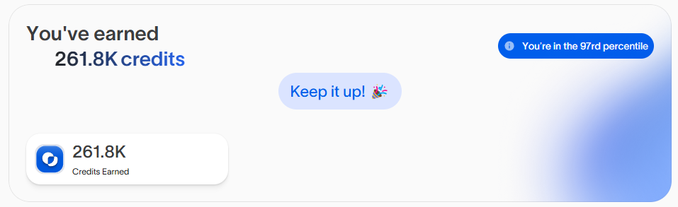

# OASIS AI BETA CLI 版本
**不介意的话走我的链接注册吧~https://r.oasis.ai/xuegaozhanshen**


由分布式计算提供支持的AI推理

# 特性



- **注册/登录账户**

- **自动创建提供者**

- **自动发送心跳**

- **支持多个账户**

- **支持代理**

## 要求

- **Node.js**: 请确保已安装 Node.js。

- **NPM**: 请确保已安装 npm。

将你的代理放在文件 `proxy.txt` 中，格式为 `http://username:pass@ip:port`，每个提供者一个代理。

所以如果你想创建多个提供者，你需要在文件中放置多个代理。

## 设置

1. 克隆此仓库：

   ```bash
   git clone https://github.com/Gzgod/oasis-bot.git
   cd oasis-bot
   ```

2. 安装依赖：

   ```bash
   npm install
   ```

3. 将你的邮箱和密码放入 `accounts.txt` 文件中，格式为 `email|password`，每行一个账户

   ```bash
   nano accounts.txt
   ```

4. 将你的代理放入 `proxy.txt` 文件中

   ```bash
   nano proxy.txt
   ```

5. 设置以创建账户/登录并获取令牌：

   ```bash
   npm run setup
   ```

6. 运行脚本：

   ```bash
   npm run start
   ```

7. 额外功能：自动推荐
   ```bash
   npm run autoreff
   ```

## 

此项目采用 [MIT License](LICENSE) 许可。
